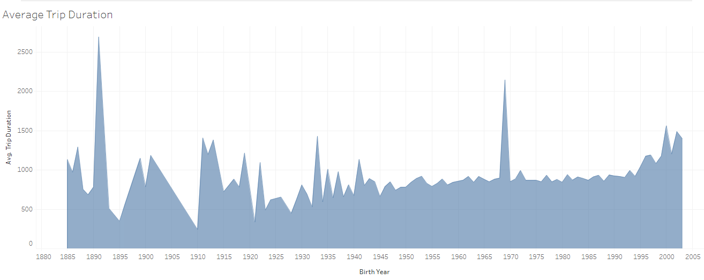
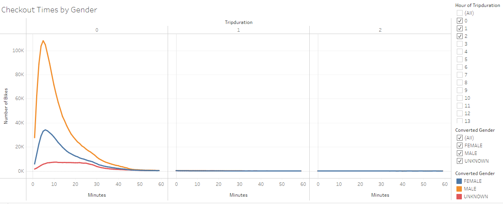
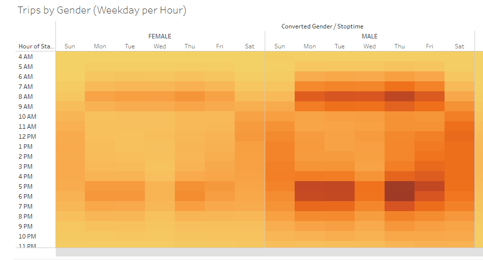
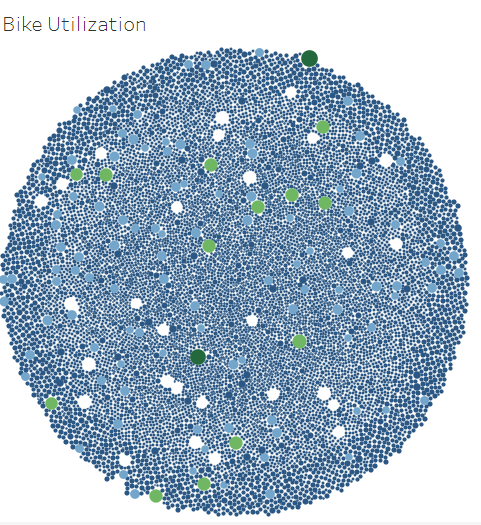
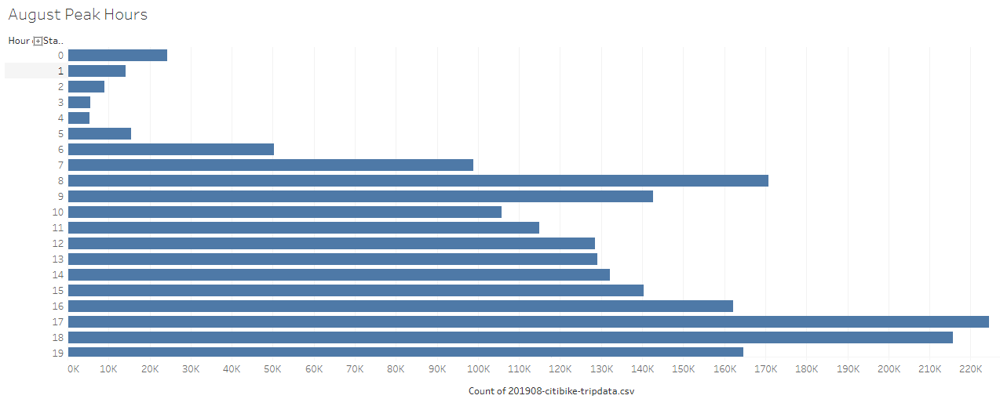
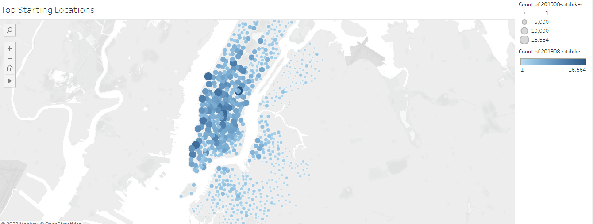
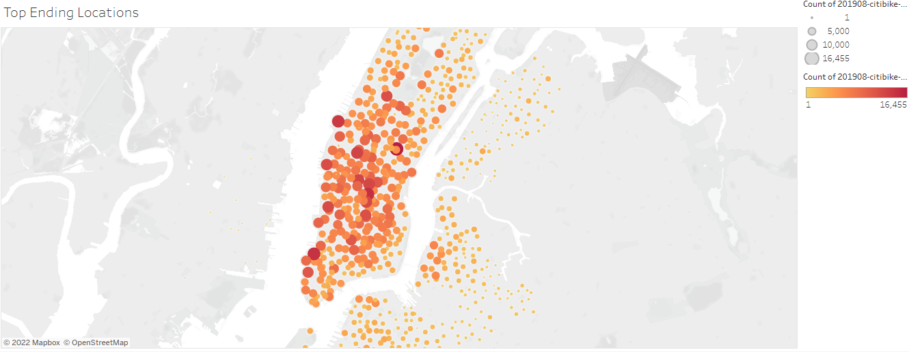

# Proposal for Bikesharing Starter in Des Moines, IA
--- 
 

## Overview   

Bikesharing has long been a concept in major cities within the U.S.. Kate, a very charismatic friend of mine, enlisted my help to get a presentation together using Tableau. Her goal was to present a business proposal to a high-end investor that they could not possibly refuse. To achieve this goal, I utilized data Kate had on Citibike from NYC. From this I was able to gather information on user types, differences in use based on gender, which bikes were used the most often, what the best times for maintenance on the bikes would be, etc.  
 
## Results   

Check out the link below for access to all visualizations created with Tableau. Several featured in this article.  
[Link to Tableau Profile](https://public.tableau.com/app/profile/ryann.alexander)   

Converting data from NYC to fit a major city in the Midwest was no small feat. To begin, I focused on what my general user population looked like: age, gender, type (subscriber or customer), and average trip length.    

### Age and Gender   

 
*Figure 1: Module figure that shows trip duration increasing in length as the user's age decreases.*   

  
*Figure 2: Most bikes are checked out by male users, and trips typically last five minutes.*   

 
*Figure 3: Heat map showing most popular times of the day to use Citibike.*   

 Citibike clearly has times of the day, and even days of the week, where it is more popular amongst the populus. These three figures alone help us form multiple conclusions:   

1. Younger riders take longer rides.  
2. Most riders are male.  
3. Most popular time to use Citibike is around the beginning and end of the average workday.  
4. Needed maintenance on the bikes would be best completed in the early hours of the morning.  
5. Although females use the service much less than male riders, they also use the bikes around the same time of day, and even on the same days.    

### Bicycle Maintenance   

I dug deeper into the issue of bicycle maintenance, so Kate could have all her bases covered during the proposal. Not only did I need to find out when I could acquire the bikes for maintenance, but also which ones were in most need of care.   

  
*Figure 4: Bubble map showing most popular bike IDs by changing the size of the bubble. Difference in color illustrates how far users travel on those specific bikes.*   

  
*Figure 5: Horizontal bar chart showing most popular hours for bike usage. Hours displayed on y-axis in military time.*    

### Starting and Ending Points   

Kate's presentation is certainly strong. Thanks to the Tableau charts we now know when most people use the bikes, for how long and on which days, and the users' age ranges. But where are most people getting on the bikes and off?   

  
*Figure 6: Map with circlemarkers of varying size to demonstrate the most common trip starting points.*   

  
*Figure 7: Most common ending points.*   

Figures 6 and 7 reinforce the short trip duration that the data revealed in earlier figures, but shows us another interesting fact. Most trips occur around Manhattan, which is a popular tourist location.    

## Summary   

In closing, investors would be wise to set up bike hubs at major tourist locations within Des Moines, near college campuses, and in areas where many shops and restaurants can be reached within a short ride. Maintenance can be done on the bikes between the hours of 2 and 5 in the morning without disturbing customers or subscribers. Finally, marketing should be aimed towards Des Moines' male population. 

